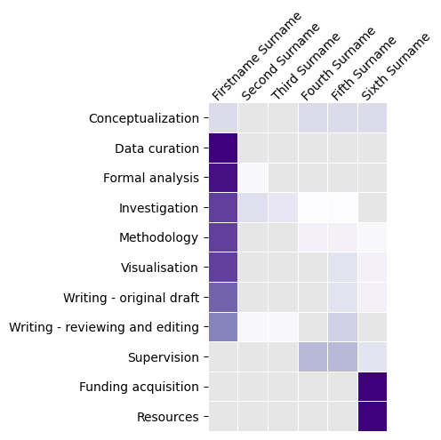

# `creditauthor` : make CRediT heatmaps
Inspired by various scientists using [heatmaps to give fair credit](https://www.nature.com/nature-index/news/researchers-embracing-visual-tools-contribution-matrix-give-fair-credit-authors-scientific-papers) using [CRediT](https://credit.niso.org/) here is `creditauthor`, a small tool to make a heatmap image for author contributions.

Usage
```
python creditauthor.py path/to/file.xlsx
```

To see function help:
```
python creditauthor.py --help
```

The table file (Excel or CSV) assumes the following format:
- First column of the table is each Role.
- Each column is an author, with their identity in the header row and their contribution to each Role in the cells below.

## Example
`example.csv` contains data in the format used to generate `example.png` with `python creditauthor.py example.png`.

Note that the values don't necessarily have to add up to 100 per row: this is a visualisation tool so jig the numbers until the heatmap represents what you want.

Where values are not entered the color will be specified using the `--grey` value.


## See also:
- Matplotlib's colormaps: https://matplotlib.org/stable/users/explain/colors/colormaps.html
- The International Brain Repository's approach: https://github.com/int-brain-lab/paper-behavior/blob/master/authorship/Authorship%20and%20contribution%20for%20IBL%20behavior%20paper.ipynb